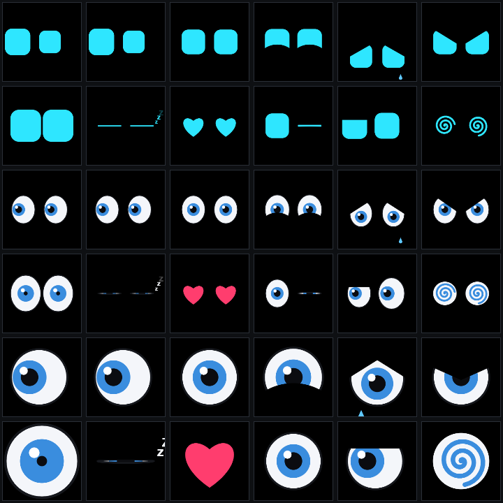

# esp32-anim-display

**Create animations in the browser and play them on small TFT/OLED displays driven by an ESP32-C3 / ESP32-C6 over Wi-Fi.**

สร้างแอนิเมชันในเบราว์เซอร์ ทั้ง pixel art, ดวงตาแสดงอารมณ์, GIF และวิดีโอ แล้วส่งผ่าน Wi-Fi ไปเล่นบนจอเล็กที่ต่อกับ ESP32

<p align="center">
  
</p>

## ความสามารถ

- **Web Editor ในตัว:** บอร์ดเปิดหน้า Editor ให้เอง ไม่ต้องลงโปรแกรม ใช้ได้ทั้งคอมและมือถือ
- **วาด pixel art:** มีเครื่องมือวาด, เฟรม, onion skin, palette สำเร็จรูป และ undo/redo
- **แม่แบบดวงตา:** 12 อารมณ์ × 3 แบบ (หุ่นยนต์ / การ์ตูน / ตาเดียวสำหรับจอกลม) ปรับสี ขนาด และความลื่นได้
- **นำเข้า GIF และวิดีโอ:** ตัดช่วงเวลา, ครอป, ปรับ fps แปลงในเบราว์เซอร์ทั้งหมด
- **ปรับสี:** ความสว่าง, คอนทราสต์, ความสด, เฉดสี, จำนวนสี จอ OLED มีการแปลงขาวดำ + dither
- **จำลองจอตามจริง:** สี RGB565 / ขาวดำ 1 บิต, มาสก์จอกลม เปลี่ยนรุ่นจอได้ทุกเมื่อ
- **ส่งไปบอร์ดในคลิกเดียว:** ดูสดบนจอจริงขณะแก้ไขได้
- **จัดการบอร์ดผ่านเว็บ:** ไฟล์, playlist, ตั้งค่าจอ, Wi-Fi
- **ไฟล์เล็ก:** รูปแบบ [.dpa](docs/dpa-format.md) เก็บเฉพาะส่วนที่เปลี่ยน เช่น ดวงตามองซ้าย-ขวาบนจอ 240×240 ใช้แค่ 24 KB

<p align="center">
  
</p>

## ฮาร์ดแวร์ที่รองรับ

| บอร์ด | จอ |
|-------|----|
| ESP32-C3 SuperMini | TFT 0.96" ST7735S 80×160 |
| ESP32-C6 SuperMini | TFT 1.3" ST7789 240×240 |
| | TFT กลม 1.28" GC9A01 240×240 |
| | OLED 0.96" SSD1306 / 1.3" SH1106 128×64 |
| | OLED 0.91" SSD1306 128×32 |

เปลี่ยนรุ่นจอจากหน้าเว็บได้โดยไม่ต้องคอมไพล์ใหม่ การต่อสายดูที่ [firmware/README.md](firmware/README.md)

## เริ่มใช้งาน

1. **แฟลชเฟิร์มแวร์** ด้วย [PlatformIO](https://platformio.org/) (ใช้ PowerShell หรือ VS Code):

   ```bash
   cd firmware; python -m platformio run -e c3_supermini -t upload
   ```

   ถ้าเป็นบอร์ด C6 ใช้ `-e c6_supermini`

2. **เชื่อม Wi-Fi ของบอร์ด** ชื่อ `DisplayEditor-XXXX` รหัส `displayedit` หน้า Editor จะเปิดขึ้นเอง (หรือเข้า http://192.168.4.1)
3. **ตั้งรุ่นจอ:** ไปที่ "บอร์ด" → "ตั้งค่าจอ" เลือกรุ่นจอ แล้วกด "ภาพทดสอบ" เพื่อตรวจ
4. **สร้างแอนิเมชัน:** เช่น "แม่แบบดวงตา" → สร้าง → **ส่งไปบอร์ด**

ถ้าจะใช้ Wi-Fi บ้าน ไปที่ "บอร์ด" → "Wi-Fi" หลังจากนั้นเข้าได้ที่ http://display.local

**ปุ่ม BOOT บนบอร์ด:** กดสั้น = แอนิเมชันถัดไป, กดค้าง 2 วินาที = แสดงชื่อ Wi-Fi และ IP บนจอ

### ลองโดยไม่มีบอร์ด

ใช้บอร์ดจำลองที่ตอบ API เหมือนของจริง ต้องติดตั้งแพ็กเกจก่อนครั้งแรก:

```bash
cd web; npm install
```

แล้วรันสองคำสั่งนี้ใน terminal แยกกัน:

```bash
cd web; npm run mock-board
```

```bash
cd web; npm run dev:mock
```

แล้วเปิด http://localhost:5173

## โครงสร้าง

| โฟลเดอร์ | คืออะไร |
|----------|---------|
| [`firmware/`](firmware/README.md) | เฟิร์มแวร์ ESP32 (PlatformIO + Arduino 3.x): ตัวเล่นแอนิเมชัน, ที่เก็บไฟล์, Wi-Fi, REST API, หน้า Editor ที่ฝังไว้ |
| [`web/`](web/README.md) | Web Editor (Vite + Preact + TypeScript) |
| [`docs/`](docs/architecture.md) | [โครงสร้างระบบ](docs/architecture.md) · [รูปแบบไฟล์ .dpa](docs/dpa-format.md) · [REST API](docs/api.md) |
| `shared/test-vectors/` | ไฟล์ทดสอบที่ทั้งตัวเข้ารหัส (TypeScript) และตัวถอดรหัส (C++) ต้องให้ผลตรงกันทุกพิกเซล |

## สถานะ

โค้ดครบทุกส่วนและคอมไพล์ผ่านทั้ง ESP32-C3 และ C6 ทดสอบแล้วด้วย:
- unit test ฝั่งเว็บ
- test ตัวถอดรหัส C++ บน PC
- บอร์ดจำลอง

**ยังไม่ได้ทดสอบกับบอร์ดและจอจริง** แผนงานดูที่ [PLAN.md](PLAN.md)
